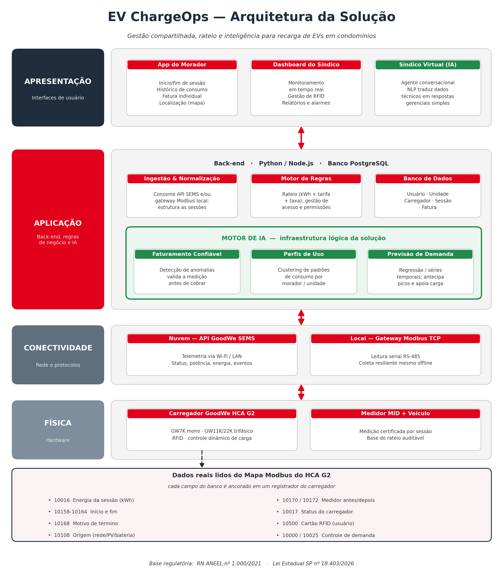

# EV ChargeOps — Sprint 01: Pesquisa e Proposta

> Enterprise Challenge 2026 · FIAP + GoodWe
> Trilha on-line — Transformar a solução residencial de recarga em uma solução **coletiva** para condomínios e ambientes corporativos.

---

## Equipe

| Nome | RM |
|------|----|
| André Luiz Hlatchuk | 571789 |
| Bruno Trevizan Strapazzon | 573816 |
| Lucas Matheus Laitart | 573137 |

---

## 1. Problema e contexto do desafio

A GoodWe é uma fabricante global de inversores e sistemas de armazenamento de energia, com mais de 100 GW de capacidade instalada acumulada em mais de 100 países. No Brasil, mantém com a FIAP o Energy Innovation Lab (Unidade 2, Aclimação), onde opera um carregador veicular GoodWe HCA G2 no estacionamento L1.

O crescimento acelerado da frota de veículos elétricos cria um problema operacional concreto: infraestruturas de recarga **compartilhadas** — em condomínios residenciais, edifícios corporativos e campus — não dispõem de mecanismos integrados para estruturar sessões por usuário, calcular o consumo individual, aplicar regras de rateio justas e oferecer uma experiência digital clara a moradores e gestores. Hoje o carregador entrega energia, mas os dados que ele gera (duração, kWh, horário, frequência, ociosidade) se perdem como registros soltos.

**Pergunta que orienta o projeto:** como transformar sessões de recarga de veículos elétricos em uma infraestrutura compartilhada em dados estruturados, rateio justo e inteligência acionável?

O **EV ChargeOps** é a resposta da equipe: uma plataforma de gestão compartilhada que estrutura cada sessão por usuário ou unidade habitacional, processa o consumo individual para cobrança automática e usa inteligência artificial como motor lógico da operação — não como recurso decorativo de interface.

### Para quem serve e o que resolve hoje

O produto atende dois perfis simultâneos. O **síndico ou gestor** ganha controle de demanda, rateio automático e auditável, e visão operacional em tempo real. O **morador ou usuário** ganha transparência: sabe quanto consumiu, quanto vai pagar e por quê. O problema regulatório e operacional que a solução resolve hoje é direto — a recém-sancionada legislação paulista (detalhada na Frente 2) cria o direito individual à recarga em condomínios, mas exige tratamento isonômico e balanceamento de carga que atenda a todos em iguais condições. O EV ChargeOps é justamente a camada de software que viabiliza essa gestão coletiva justa.

---

## 2. Frente 1 — Contexto e Problema

### 2.1 Infraestruturas de recarga compartilhada

São estações de recarga instaladas em locais de uso coletivo (condomínios, empresas, campus) nos quais múltiplos usuários utilizam o mesmo equipamento ou o mesmo ramal elétrico. Os principais desafios operacionais dos gestores são:

- **Gestão de acesso:** controlar quem pode usar, quando e com qual prioridade.
- **Rateio de custos:** dividir a conta de energia de forma justa, transparente e juridicamente defensável.
- **Limitação elétrica:** a carga disponível no edifício é finita; vários veículos carregando ao mesmo tempo podem disparar a proteção geral, exigindo gestão dinâmica de carga (*load balancing*).
- **Manutenção e disponibilidade:** monitorar falhas e indisponibilidade em tempo real.
- **Experiência do usuário:** facilidade de identificação, acompanhamento da recarga e clareza na cobrança.

### 2.2 A sessão de recarga do ponto de vista técnico

Entre conectar o veículo e encerrar a sessão, ocorre uma sequência bem definida:

`Conexão do conector` → `Autenticação (RFID / app)` → `Handshake entre carregador e veículo` → `Início da carga` → `Monitoramento contínuo` → `Encerramento` → `Desconexão`.

Cada etapa gera dados: identificação do usuário, identificação do carregador, *timestamps* de início e fim, energia entregue (kWh), potência instantânea (kW), tensão (V), corrente (A) e eventos de erro. No HCA G2, esses dados podem ser capturados por dois caminhos — a API em nuvem da GoodWe (SEMS Portal) e a leitura local dos registradores via protocolo Modbus TCP (detalhados na Frente 2). É essa rastreabilidade por sessão que torna o rateio individual tecnicamente possível.

### 2.3 Modelos de negócio para recarga compartilhada

| Modelo | Como funciona | Quando faz sentido |
|--------|---------------|--------------------|
| Recarga gratuita | Custo absorvido pelo condomínio/empresa como benefício | Atrair clientes/funcionários; baixo volume |
| Cobrança por kWh | Usuário paga exatamente o que consumiu | Justiça de consumo; cenário condominial |
| Cobrança por tempo | Pagamento pela duração da sessão | Locais de alta rotatividade |
| Assinatura mensal | Valor fixo com uso ilimitado ou franquia de kWh | Usuários recorrentes |
| Rateio condominial | Custo individual repassado no boleto do condomínio | Condomínios residenciais — foco do ChargeOps |

### 2.4 Opção de aprofundamento escolhida — A: Análise de mercado

A equipe analisou três soluções que resolvem problemas semelhantes ao EV ChargeOps:

**1. Neocharge**
*Problema que resolve:* gestão e cobrança de recarga em ambientes compartilhados no Brasil.
*Funcionalidades:* plataforma de gestão com aplicativo, monitoramento em tempo real, relatórios e cobrança automatizada.
*Modelo de negócio:* venda de hardware + assinatura de software de gestão.
*Limitações conhecidas:* forte acoplamento ao próprio ecossistema de hardware; menor flexibilidade para integrar carregadores de terceiros sob um único painel.

**2. Wallbox (Pulsar Plus + myWallbox)**
*Problema que resolve:* recarga residencial e semipública com hardware compacto e conectado.
*Funcionalidades:* gestão de carga, conectividade Bluetooth/Wi-Fi, app de monitoramento e balanceamento dinâmico de potência.
*Modelo de negócio:* venda de hardware com camada de software complementar.
*Limitações conhecidas:* o foco do produto é o carregador individual; o rateio e a gestão multiusuário em condomínio não são o centro da plataforma, exigindo soluções adicionais.

**3. ChargePoint**
*Problema que resolve:* operação de redes de recarga em larga escala (comercial e público).
*Funcionalidades:* hardware + software completos, forte ênfase em interoperabilidade, dados e billing.
*Modelo de negócio:* hardware, assinatura de rede e taxas de transação.
*Limitações conhecidas:* solução robusta porém dimensionada para grandes operadores; complexidade e custo elevados para um condomínio residencial, e presença limitada no mercado brasileiro.

**Conclusão da análise:** as soluções existentes ou se concentram no carregador individual, ou são dimensionadas para grandes operadores comerciais. Há um espaço claro para uma plataforma **focada no condomínio**, agnóstica ao caminho de coleta de dados (nuvem ou Modbus local) e centrada em rateio justo, gestão coletiva e experiência tanto do morador quanto do síndico. É esse espaço que o EV ChargeOps ocupa.

---

## 3. Frente 2 — Base Regulatória e Técnica

### 3.1 Resolução Normativa ANEEL nº 1.000/2021

A RN ANEEL nº 1.000/2021 sustenta três pontos fundamentais para a viabilidade do projeto:

- **Exploração comercial livre:** a atividade de recarga de veículos elétricos pode ser explorada comercialmente por qualquer interessado, com preços livremente negociados — não é tratada como serviço público de energia. Isso torna legal a cobrança pela recarga e justifica o desenvolvimento de uma plataforma de tarifação/rateio.
- **Comunicação à distribuidora:** a instalação de estações de recarga deve ser informada à distribuidora local de energia.
- **Protocolos abertos:** equipamentos não exclusivos de uso privado devem adotar protocolos abertos de comunicação, viabilizando controle remoto e interoperabilidade. Essa exigência é a justificativa regulatória direta para a arquitetura aberta da solução (Modbus / OCPP).

### 3.2 Opção de aprofundamento escolhida — A: Mapeamento regulatório estadual (São Paulo)

Além da norma federal, a equipe verificou a legislação estadual aplicável e confirmou em fonte oficial uma norma diretamente relacionada ao caso de uso:

**Lei Estadual de São Paulo nº 18.403, de 18 de fevereiro de 2026** (originada do Projeto de Lei nº 425/2025, sancionada e em vigor):

- Assegura ao condômino o direito de instalar, às suas expensas, estação de recarga individual em sua vaga de garagem privativa, em edificações residenciais ou comerciais.
- Condiciona a instalação a requisitos técnicos: compatibilidade com a carga elétrica da unidade, conformidade com as normas da distribuidora e da ABNT, execução por profissional habilitado (com ART ou RRT) e comunicação formal prévia ao condomínio.
- Estabelece que o condomínio **não pode proibir** a instalação sem justificativa técnica ou de segurança devidamente comprovada.
- Determina que novos empreendimentos aprovados após a vigência da lei prevejam capacidade elétrica mínima para suportar a futura instalação de carregadores.

**Conformidade e oportunidade da solução:** a lei cria o direito individual, mas as entidades do setor (Secovi-SP) reforçam que o condomínio deve assegurar **tratamento isonômico** entre condôminos e que **a infraestrutura e o balanceamento de carga devem atender a todos em iguais condições**. É exatamente esse o problema que o EV ChargeOps resolve: a plataforma fornece a gestão de acesso, o balanceamento de carga e o rateio auditável que permitem que o direito individual seja exercido sem onerar nem prejudicar a coletividade. A solução, portanto, não apenas está em conformidade — ela operacionaliza o que a lei exige.

### 3.3 Carregador GoodWe HCA G2 — interfaces e capacidades

A linha HCA G2 abrange três modelos: **GW7K-HCA-20** (monofásico, 230 V, 7 kW), **GW11K-HCA-20** (trifásico, 400 V, 11 kW) e **GW22K-HCA-20** (trifásico, 400 V, 22 kW). Para a plataforma, as interfaces de comunicação são o ponto-chave:

| Interface | O que permite | Uso pela plataforma |
|-----------|---------------|---------------------|
| **RFID** | Autenticação física por cartão (2 inclusos, até 10) | Identificar **quem** está carregando — base do rateio individual |
| **RS-485** | Comunicação serial (×2) | Integração local com medidor MID e leitura de registradores Modbus |
| **LAN / Wi-Fi** | Conectividade de rede | Sincronização com a nuvem (SEMS Portal) |
| **Bluetooth** | Configuração e autenticação local | Comissionamento e início de sessão pelo app |

O carregador também oferece **controle dinâmico de carga**, **agendamento**, **início automático** e modos de carregamento que priorizam energia solar (PV) ou PV + bateria. Possui proteções integradas (sobretensão, sobrecorrente, curto-circuito, fuga, sobretemperatura, surtos), grau de proteção IP66 (corpo) e IP55 (plugue) e faixa operacional de -30 °C a +50 °C — robustez compatível com instalação em estacionamentos e áreas externas. O protocolo de comunicação declarado é **Modbus TCP**. Um ponto técnico decisivo: o equipamento pode se conectar a um **medidor MID** para mensurar o consumo com precisão certificada, o que sustenta tecnicamente o faturamento individual e a rastreabilidade por sessão.

### 3.4 API GoodWe (SEMS Portal) e o Mapa Modbus

A plataforma EV ChargeOps pode coletar dados por **dois caminhos complementares**, e essa redundância é uma decisão de arquitetura, não um detalhe:

**Caminho 1 — Nuvem (API SEMS Portal).** Expõe dados consolidados da estação: status (online/offline), potência (kW), energia acumulada (kWh) e eventos. É o caminho mais simples para sincronização centralizada.

**Caminho 2 — Local (Mapa Modbus do HCA G2).** O carregador expõe uma interface serial (9600 baud, 8 bits de dados, 1 stop bit, paridade N) com registradores que podem ser lidos por um gateway local e encaminhados à plataforma. Esse caminho garante coleta resiliente mesmo com a nuvem indisponível e dá acesso granular a dados que a API consolidada pode não expor. Os registradores mais relevantes para o ChargeOps:

| Registrador | Conteúdo | Função no ChargeOps |
|-------------|----------|---------------------|
| `10016` | Energia desta sessão (kWh) | Métrica principal do rateio |
| `10170` / `10172` | Leitura do medidor antes / depois da carga | Auditoria do consumo da sessão |
| `10015` | Potência de carga (kW) | Monitoramento em tempo real |
| `10063` / `10166` | Duração da sessão (s) | Detecção de ociosidade e relatórios |
| `10017` | Status do carregador (ocioso / conectado / carregando / concluído / interrompido…) | Estado da sessão |
| `10168` | Motivo de término da carga | Distinguir falha de uso normal |
| `10158`–`10160` / `10162`–`10164` | Início e fim (ano/mês, dia/hora, min/seg) | Registro temporal da sessão |
| `10500` (e `10507`/`10514`) | Número do cartão RFID (e gestão de cartões) | Vínculo usuário ↔ sessão |
| `10108` / `10103` / `10105` | Origem da energia (rede/PV/bateria), energia verde, energia comprada | Diferenciar solar de rede no rateio |
| `10000` / `10025` | Despacho EMS (força potência mínima) / gestão dinâmica de carga | Controle de demanda do edifício |
| `30000+` | Informações de alarme (IoT) | Insumo para detecção de anomalias |

> **Observação metodológica:** os endpoints específicos da API SEMS (ex.: rotas de login e de detalhe da estação) devem ser confirmados na documentação oficial da GoodWe antes da implementação na Sprint 02. Os registradores Modbus acima foram extraídos diretamente do documento *Mapa Modbus HCA G2* fornecido no desafio.

### 3.5 Opção de aprofundamento escolhida — C: APIs complementares

Duas APIs externas foram mapeadas para enriquecer a plataforma:

**1. Open Charge Map API** — base aberta com a localização e os detalhes de estações de recarga públicas no mundo todo. *Uso:* alimentar um mapa de pontos de recarga próximos para o usuário quando estiver fora de casa (recarga de oportunidade).

**2. Google Places API (campo `evChargeOptions`)** — detalha opções de recarga em estabelecimentos comerciais. *Uso:* enriquecer a experiência do morador com pontos de recarga e conveniências próximas, cruzando a infraestrutura privada do condomínio com o mapa público.

*(Fonte adicional considerada: ANEEL Open Data, para atualização periódica de tarifas de energia que alimentam o cálculo do rateio.)*

---

## 4. Frente 3 — Arquitetura e IA

### 4.1 Diagrama de arquitetura



### 4.2 As quatro camadas da plataforma

**1. Camada Física (hardware).** Carregador GoodWe HCA G2 e, opcionalmente, medidor MID e o veículo elétrico. Responsável pela entrega de energia e pela geração dos dados brutos de cada sessão.

**2. Camada de Conectividade (rede e protocolos).** Transporta os dados da camada física para a aplicação por dois caminhos: nuvem (API SEMS via Wi-Fi/LAN) e local (gateway Modbus TCP via RS-485). A redundância garante resiliência.

**3. Camada de Aplicação (back-end, regras de negócio e IA).** O coração do sistema. Reúne os serviços de **ingestão e normalização** (consome a API ou o gateway e estrutura as sessões), o **banco de dados** (PostgreSQL), o **motor de regras de negócio** (rateio, acesso, permissões) e o **motor de IA**, descrito em detalhe na seção 4.5.

**4. Camada de Apresentação (interfaces).** O **app do morador** (início/fim de sessão, histórico, fatura, mapa), o **dashboard do síndico** (monitoramento, gestão de usuários, relatórios, alarmes) e o **Síndico Virtual** — agente conversacional em linguagem natural.

### 4.3 Fluxo de dados — da sessão à fatura

1. **Início e identificação:** o usuário conecta o veículo e se autentica por RFID (`10500`) ou app no HCA G2.
2. **Coleta:** durante a sessão, o carregador registra kWh (`10016`), potência (`10015`), tempo (`10063`) e *timestamps* (`10158`–`10160`).
3. **Transmissão:** os dados seguem pela camada de conectividade (API SEMS e/ou gateway Modbus).
4. **Ingestão e validação:** o back-end estrutura a sessão e, neste ponto, a IA **valida a medição** — compara `10016` com a diferença entre `10172` e `10170` e checa o motivo de término (`10168`) antes de permitir qualquer cobrança.
5. **Cálculo do rateio:** o motor de regras aplica a fórmula de rateio (seção 4.4) sobre os dados validados.
6. **Persistência:** sessão e custo são gravados no banco.
7. **Apresentação:** o morador vê a fatura e o histórico; o síndico vê relatórios e alarmes; o Síndico Virtual responde dúvidas em linguagem natural.

A IA não está no fim do fluxo como um relatório bonito — ela é o portão entre o dado bruto e a cobrança, garantindo que nenhuma fatura seja emitida sobre uma medição inconsistente.

### 4.4 Modelo de rateio

**Objetivo:** ser justo, transparente e juridicamente defensável (atendendo à exigência de isonomia da Lei SP 18.403/2026).

**Variáveis:**
- **kWh consumido** — métrica principal, lida de `10016` e auditada por `10170`/`10172`.
- **Tarifa de energia** — por kWh; pode variar por horário (ponta / fora de ponta) e ser atualizada via ANEEL Open Data.
- **Taxa de serviço/manutenção** — valor fixo que cobre custos da infraestrutura comum (manutenção do carregador, conectividade, gestão).

**Fórmula da fatura individual:**

```
Fatura_individual = (kWh_consumido × Tarifa_energia) + Taxa_serviço
```

**Por que este modelo (e não outro):** a equipe optou pelo modelo **por kWh + taxa fixa de manutenção**, em vez de cobrança puramente por tempo ou puramente por kWh. A cobrança por tempo penalizaria injustamente quem tem um veículo de carga mais lenta; a cobrança apenas por kWh não cobriria os custos comuns da infraestrutura, que existem independentemente do consumo de cada um. O modelo híbrido distribui o custo variável de forma proporcional ao uso real (justiça) e o custo fixo de forma isonômica entre os beneficiários da infraestrutura (sustentabilidade do sistema). O horário de ponta entra como modulador opcional da tarifa, criando incentivo natural para carregar fora dos picos — o que ajuda no controle de demanda do edifício.

**Tratamento de casos excepcionais:**

| Caso | Tratamento |
|------|-----------|
| **Sessão interrompida** | Cobra-se apenas a energia efetivamente entregue até a interrupção (`10016` no momento do corte). O registrador `10168` registra o motivo; se for falha de hardware, a IA sinaliza e a taxa de serviço da sessão pode ser isenta. |
| **Usuário que não carregou no mês** | Não há cobrança de kWh. A taxa de serviço pode ou não ser aplicada conforme a convenção condominial — a plataforma permite as duas configurações. |
| **Dois veículos da mesma unidade** | Cada veículo gera uma sessão individual (identificada pelo cartão RFID, `10500`), com consumo medido separadamente. As sessões são consolidadas na mesma fatura da unidade, preservando o detalhamento por veículo. |

### 4.5 Papel da IA — o motor lógico da solução

A IA do EV ChargeOps **não é um recurso de interface**; é a camada que dá sentido aos dados brutos gerados pela rede e sem a qual o produto não cumpre sua proposta. A equipe estrutura o papel da IA em três frentes que se reforçam, com destaque para o Síndico Virtual como protagonista da experiência.

**Opção de aprofundamento escolhida — B: Definição do papel da IA.**

**(a) Faturamento confiável por detecção de anomalias** *(protagonista do back-end)*
*Problema que resolve:* impedir que cobranças sejam geradas sobre medições inconsistentes ou que falhas/abusos passem despercebidos.
*Técnica:* detecção de anomalias e classificação (ex.: Isolation Forest, DBSCAN, Random Forest) sobre os dados de sessão.
*Dados necessários:* `10016` (kWh), `10170`/`10172` (medidor antes/depois), `10168` (motivo de término), `10015` (potência), alarmes `30000+`.
*Impacto esperado:* faturamento auditável e confiável, detecção precoce de falhas de hardware e identificação de uso indevido — pré-condição para o rateio ter validade jurídica.

**(b) Perfis de uso por clustering** *(suporte à gestão)*
*Problema que resolve:* entender como os moradores realmente usam a infraestrutura para apoiar decisões do síndico (precificação de ponta, necessidade de novos pontos, regras de uso).
*Técnica:* clustering (ex.: K-Means) sobre histórico de sessões.
*Dados necessários:* histórico de `10016`, duração (`10063`), horários (`10158`–`10164`), frequência por usuário.
*Impacto esperado:* segmentação de perfis (ex.: "carga noturna longa", "recarga rápida diurna") que orienta políticas de uso compartilhado e janelas de carga otimizadas.

**(c) Síndico Virtual — agente conversacional (NLP)** *(protagonista da experiência)*
*Problema que resolve:* a maior dor de gestão em condomínio é a falta de transparência — o morador não entende a conta e o síndico não tem tempo de explicar caso a caso.
*Técnica:* Processamento de Linguagem Natural traduzindo dados técnicos em respostas gerenciais simples.
*Dados necessários:* todas as sessões consolidadas, faturas e alarmes.
*Impacto esperado:* o morador pergunta *"por que minha conta veio mais alta esse mês?"* e recebe uma resposta clara, baseada nos dados reais das suas sessões (ex.: número de recargas, kWh, horários de ponta). O síndico pergunta *"quais carregadores tiveram falha esta semana?"* e recebe um resumo. É a IA convertendo terabytes de telemetria em orientação direta — exatamente o papel de "infraestrutura lógica" que o desafio descreve.

### 4.6 Esquema da base de dados

*(Aprofundamento adicional — Opção C da Frente 3.)*

**Entidade `Usuarios`**
`id_usuario` (PK), `nome`, `email`, `rfid_tag` ← `10500`, `unidade_id` (FK), `data_cadastro`

**Entidade `Unidades`**
`id_unidade` (PK), `bloco`, `numero_unidade`, `tipo_unidade` (residencial/comercial)

**Entidade `Carregadores`**
`id_carregador` (PK), `modelo`, `localizacao`, `status`, `potencia_max_kw`, `serial_number` ← SN Modbus `10040`

**Entidade `SessoesRecarga`**
`id_sessao` (PK), `usuario_id` (FK), `carregador_id` (FK), `inicio_sessao` ← `10158`–`10160`, `fim_sessao` ← `10162`–`10164`, `kwh_consumido` ← `10016` (auditado por `10170`/`10172`), `custo_sessao`, `duracao_minutos` ← `10063`, `fonte_energia` ← `10108`, `status_sessao` ← `10017`, `motivo_termino` ← `10168`

**Entidade `Faturas`**
`id_fatura` (PK), `unidade_id` (FK), `mes_referencia`, `valor_total`, `status_pagamento`, `data_vencimento`

**Relacionamentos:**
- `Unidades` 1:N `Usuarios` (uma unidade pode ter vários usuários)
- `Usuarios` 1:N `SessoesRecarga` (um usuário, várias sessões)
- `Carregadores` 1:N `SessoesRecarga` (um carregador, várias sessões)
- `Unidades` 1:N `Faturas` (uma unidade, várias faturas mensais)

**Registros simulados (para a Sprint 02):**

```text
Usuario:        (1, 'João Silva', 'joao.silva@email.com', 'RFID123', 1, '2026-06-01')
Unidade:        (1, 'Torre A', '101', 'Residencial')
Carregador:     (1, 'GoodWe HCA G2', 'L1 Vaga 5', 'Ativo', 11.0, 'GW22K001')
SessaoRecarga:  (1, 1, 1, '2026-06-15 10:00:00', '2026-06-15 12:30:00', 15.5, 12.40, 150, 'rede+PV', 'Concluída', 'carga_completa')
Fatura:         (1, 1, '2026-06-01', 25.80, 'Pendente', '2026-07-10')
```

---

## 5. Plano para a Sprint 02

A Sprint 02 implementará um protótipo funcional que demonstre o fluxo completo — da sessão à fatura — com a IA como motor. A ordem de desenvolvimento prioriza primeiro a espinha dorsal de dados e só depois as interfaces.

**Etapa 1 — Camada de dados e ingestão.** Modelar o banco PostgreSQL conforme a seção 4.6 e construir o serviço de ingestão. Como o desafio permite simular o ambiente, a equipe usará dados simulados estruturados a partir dos registradores Modbus reais (e, se houver acesso, dados da API SEMS) para popular as sessões.
*Tecnologias previstas:* Python (FastAPI) ou Node.js; PostgreSQL.

**Etapa 2 — Motor de regras de rateio.** Implementar a fórmula de rateio e o tratamento dos casos excepcionais (sessão interrompida, sem uso, dois veículos por unidade), gerando faturas por unidade.
*Tecnologias previstas:* Python.

**Etapa 3 — Motor de IA.** Implementar primeiro a **detecção de anomalias** (validação de medição antes da cobrança), depois o **clustering de perfis** e, por fim, o **Síndico Virtual** (NLP) sobre os dados consolidados.
*Tecnologias previstas:* scikit-learn (anomalias e clustering); integração com modelo de linguagem para o agente conversacional.

**Etapa 4 — Interfaces.** Dashboard web do síndico e app/tela do morador, consumindo a API do back-end.
*Tecnologias previstas:* React; biblioteca de gráficos para visualização de consumo.

**Etapa 5 — Integração e validação.** Conectar as camadas, validar o fluxo de ponta a ponta e preparar a demonstração para o vídeo pitch.

> **Observação:** conforme o regulamento, no 2º semestre cada integrante gravará um vídeo pitch de 3 minutos na prova presencial, etapa que valida o desenvolvimento técnico e habilita o lançamento das notas.

---

## 6. Sobre o uso de IA neste trabalho

Ferramentas de IA foram usadas como apoio à organização da pesquisa e à redação, conforme permite o item 8 do regulamento. As análises, escolhas de arquitetura, definição do modelo de rateio e do papel da IA são construções da equipe. Todas as fontes citadas foram efetivamente consultadas; em particular, a Lei Estadual SP nº 18.403/2026 foi verificada no repositório oficial da Assembleia Legislativa de São Paulo, e os registradores Modbus foram extraídos do documento técnico fornecido no desafio.

---

## 7. Fontes consultadas

**Documentos do desafio (GoodWe / FIAP):**
- Playbook oficial — *EV Challenge 2026* (1CC – EV CHALLENGE GOODWE + FIAP 2026).
- Apresentação institucional — *Challenge FIAP + GoodWe 2026*.
- *GoodWe HCA G2 — Datasheet* (PT).
- *Mapa Modbus HCA G2* — tabela de registradores do protocolo Modbus do carregador.

**Base regulatória:**
- Resolução Normativa ANEEL nº 1.000/2021.
- Lei Estadual de São Paulo nº 18.403, de 18 de fevereiro de 2026 — Assembleia Legislativa do Estado de São Paulo (`al.sp.gov.br`).

**APIs e dados (mapeadas para a solução):**
- Open Charge Map API — `openchargemap.org/site/develop`.
- Google Places API, campo `evChargeOptions` — `developers.google.com/maps/documentation/places`.
- ANEEL Open Data — `dadosabertos.aneel.gov.br`.
- GoodWe SEMS Portal — `semsplus.goodwe.com`.

**Mercado (Análise de mercado — Frente 1):**
- Neocharge, Wallbox (Pulsar Plus / myWallbox), ChargePoint — sites oficiais dos fabricantes.
